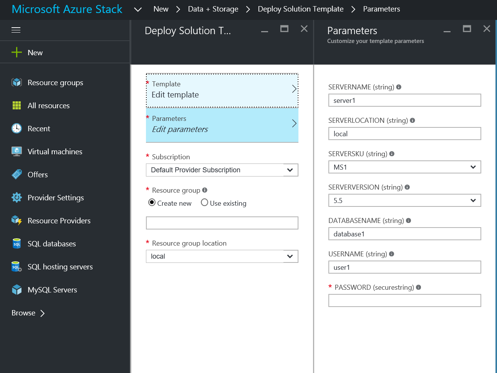

<properties
	pageTitle="Use MySQL databases as PaaS on Azure Stack | Microsoft Azure"
	description="Understand the quick steps to deploy the MySQL resource provider and provide MySQL as a service on Azure Stack."
	services="azure-stack"
	documentationCenter=""
	authors="JeffGo"
	editor=""/>

<tags
	ms.service="multiple"
	ms.workload="na"
	ms.tgt_pltfrm="na"
	ms.devlang="na"
	ms.topic="article"
	ms.date="10/05/2016"
	ms.author="jeffgo"/>

# Use MySQL databases as PaaS on Azure Stack

> [AZURE.NOTE] The following information only applies to Azure Stack TP2 deployments. There have been many changes since the TP1 release, so please read this carefully. Deployment now uses a single script.

You can deploy a MySQL resource provider on Azure Stack. After you deploy the resource provider, you can create MySQL servers and databases through Azure Resource Manager deployment templates and provide MySQL databases as a service. MySQL databases, which are common on web sites, support many website platforms. As an example, after you deploy the resource provider, you can create WordPress websites from the Azure Web Apps platform as a service (PaaS) add-on for Azure Stack.

To deploy the MySQL provider on a system that does not have internet access, you can copy the files [mysql-5.6.26-winx64.zip](https://dev.mysql.com/get/Downloads/MySQL-5.6/mysql-5.6.26-winx64.zip) and [mysql-5.5.44-winx64.zip](https://downloads.mysql.com/archives/get/file/mysql-5.5.44-winx64.zip) to a local share and provide that share name when prompted (see below).

> [AZURE.NOTE] The deployment script will perform retries to accommodate less reliable network connections.

## Steps to deploy the resource provider

1.  [Download the MySQL resource provider binaries file](http://aka.ms/masmysqlrp) and extract it on the Console VM in your Azure Stack proof of concept (PoC).

2. Run DeployMySqlProvider.cmd as an administrator by right clicking on the filename and select "Run as Admnistrator"

This script will do all of the following:

		* If necessary, download a compatible version of Azure PowerShell.
		* Create a wildcard certificate to secure communication between the resource provider and Azure Resource Manager.
		* Download the MySQL binaries.
		* Upload the certificate and all other artifacts to an Azure Stack storage account.
		* Publish gallery packages so that you can deploy MySQL resources through the gallery.
		* Deploy a virtual machine (VM) that will host both your resource provider, MySQL servers and databases that you will instantiate.
		* Register a local DNS record that will map to your resource provider VM.
		* Register your resource provider with the local Azure Resource Manager.

The script prompts for required parameters:
| Parameter Name | Description | Comment 
| ---------------|-------------|--------
**AadTenantDirectoryName**|The Azure Active Directory Name|_required_
**AzCredential**|Azure Stack Service Admin account credential|_required_
**LocalCredential**|The local administrator account of the SQL resource provider VM" and the password will also be used for the SQL **sa** account|_required_
**DomanCredential**|The domain credential to join the VM into the domain|_required_
**DomainName**|The domain to join|_required_
**PfxPassword**|Password used to protect the private key used with the certificate|_required_
**ResourceGroupName**|Resource Group for the items created by this script|Default: Microsoft-MySQL-RP1
**VmName**|Name of the VM holding the resource provider|Default: mysqlrp
**AcceptLicense**|Prompts to accept the GPL License Accept the terms of the GPL License (http://www.gnu.org/licenses/old-licenses/gpl-2.0.html)|No
**DependencyFilesLocalPath**|Path to a local share containing the MySQL files [mysql-5.6.26-winx64.zip](https://dev.mysql.com/get/Downloads/MySQL-5.6/mysql-5.6.26-winx64.zip) and [mysql-5.5.44-winx64.zip](https://downloads.mysql.com/archives/get/file/mysql-5.5.44-winx64.zip) |_leave blank to download from the internet_
**MaxRetryCount**|Each operation will be retried if there is a failure|5
**RetryDuration**|Timeout between retries, in seconds|300
|||

This should get your MySQL resource provider up and running in about 25 minutes.

## Create your first MySQL database to test your deployment

1. Sign in to the Azure Stack POC portal as service admin.

2. Click the **New** button &gt; **Data + Storage** &gt; **MySQL Server & Databases**.

3. Fill in the form with database details.

	**Make a note of the "server name" you enter.** The connections string for your database includes the "server name" as part of the user name: for example, **"user@<ServerName>"**. You will need to input a user name in this format when you connect to the database: for example, when you deploy a MySQL web site using the Azure Web Site resource provider

