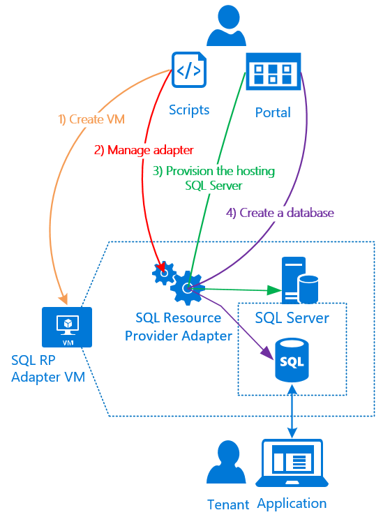
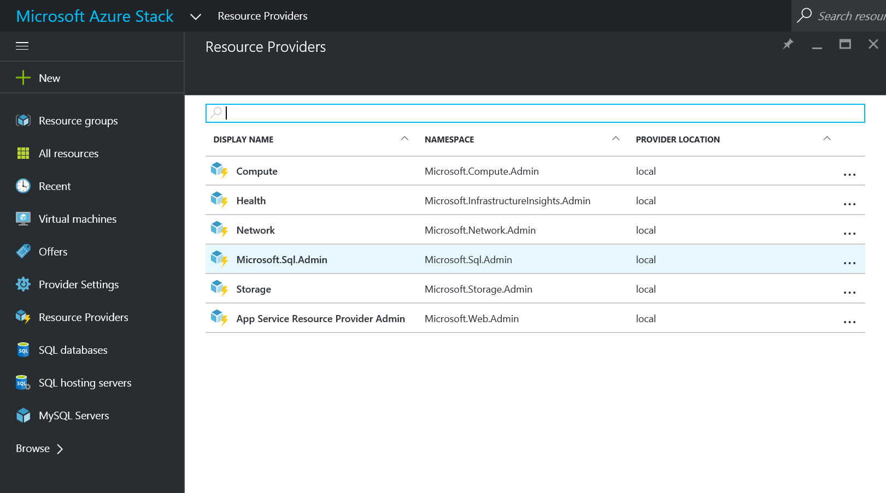
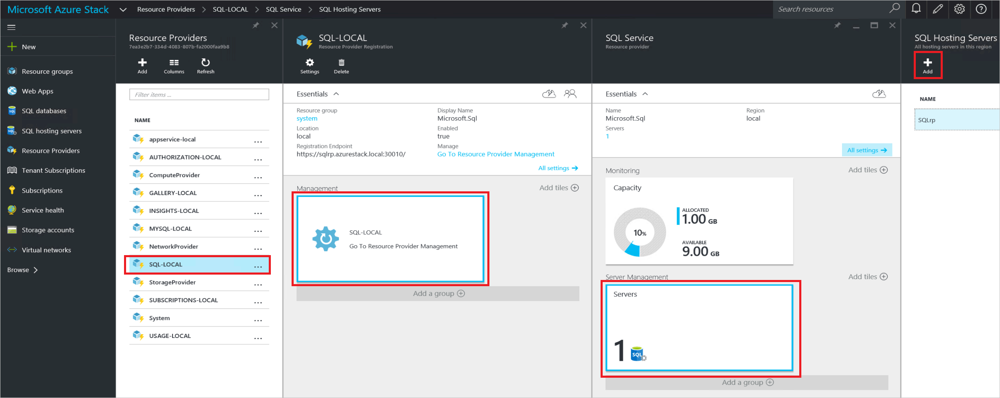
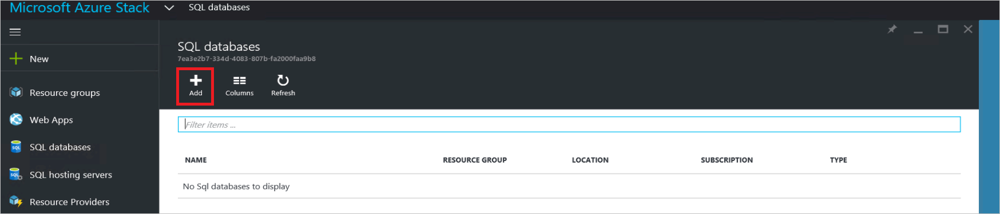
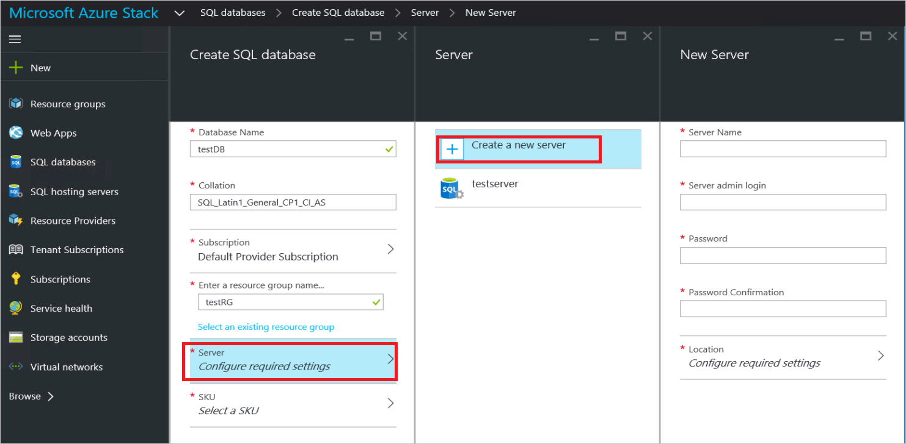
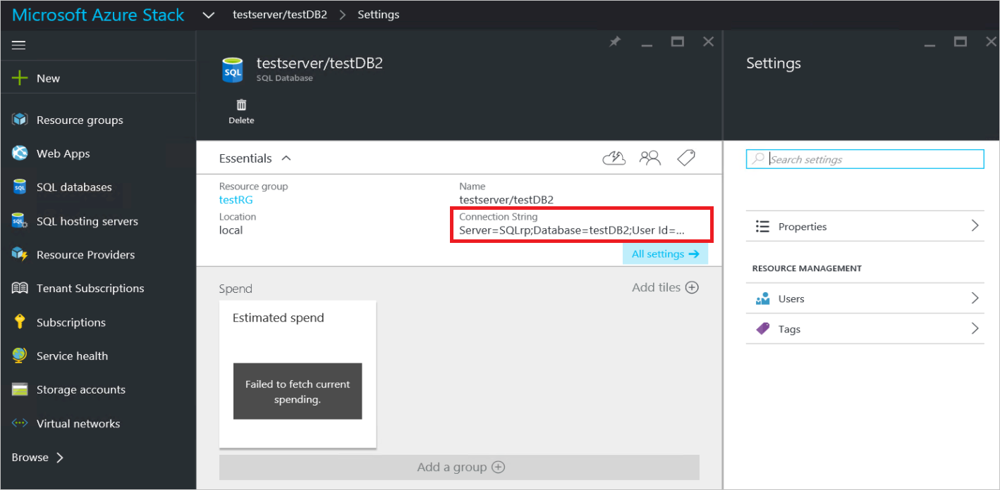

<properties
	pageTitle="Using SQL databases on Azure Stack | Microsoft Azure"
	description="Learn how you can deploy SQL databases as a service on Azure Stack and the quick steps to deploy the SQL Server resource provider adapter."
	services="azure-stack"
	documentationCenter=""
	authors="JeffGo"
	manager="byronr"
	editor=""/>

<tags
	ms.service="multiple"
	ms.workload="na"
	ms.tgt_pltfrm="na"
	ms.devlang="na"
	ms.topic="article"
	ms.date="09/30/2016"
	ms.author="JeffGo"/>

# Use SQL databases on Azure Stack

> [AZURE.NOTE] The following information only applies to Azure Stack TP2 deployments. There have been many changes since the TP1 release, so please read this carefully. Deployment now uses a single script.

Use the SQL Server resource provider adapter to expose SQL databases as a service of Azure Stack. After you install the resource provider and connect it to a SQL Server instance, you and your users can create databases for cloud-native apps, website that are based on SQL, and workloads that are based on SQL without having to provision a virtual machine (VM) that hosts SQL Server each time.

## SQL Server resource provider adapter architecture
The resource provider does not offer all the database management capabilities of Azure SQL Database. For example, elastic database pools and the ability to dial database performance up and down on the fly aren't available. However, the resource provider does support the same create, read, update, and delete (CRUD) operations that available in Azure SQL Database.

The resource provider is made up of three components:

- **The SQL resource provider adapter VM**, which encompasses the resource provider process and the servers that host SQL Server.
- **The resource provider itself**, which processes provisioning requests and exposes database resources.
- **Servers that host SQL Server**, which provide capacity for databases.

The following conceptual diagram shows these components and the steps that you go through when you deploy the resource provider, set up a server that hosts SQL Server, and then create a database.

To deploy the SQL provider on a system that does not have internet access, you can copy the file [SQL 2014 SP1 Enterprise Eval](http://care.dlservice.microsoft.com/dl/download/2/F/8/2F8F7165-BB21-4D1E-B5D8-3BD3CE73C77D/SQLServer2014SP1-FullSlipstream-x64-ENU.iso) to a local file share and provide that share name when prompted (see below).
> [AZURE.NOTE] The deployment script will perform retries to accommodate less reliable network connections.

## Steps to deploy the resource provider

1. [Download the SQL Server RP installer executable file](http://aka.ms/massqlrprfrsh) to the Console VM and extract the files. You can optionally download to another machine and copy the file to the Azure Stack console VM.

2. Right click on the DeploySQLProvider.cmd batch file and selecct "Run as Administrator" 
	
	The script will do all of the following:

		* If necessary, download a compatible version of Azure PowerShell.
		* Create a wildcard certificate to secure communication between the resource provider and Azure Resource Manager.
		* Download an evaluation build of SQL Server SP1 from the internet or from a local file share.
		* Upload the certificate and all other artifacts to a storage account on your Azure Stack.
		* Publish gallery package so that you can deploy SQL database through the gallery.
		* Deploy a VM using the default Windows Server 2012 R2 image that comes with Azure Stack. 
		* Register a local DNS record that maps to your resource provider VM.
		* Register your resource provider with the local Azure Resource Manager.
		* Connect the resource provider to the SQL server instance on the RP VM
		

	Use “sa” for username and the password that you used when you deployed the resource provider VM.

### Parameters
The script prompts for required parameters:
Parameter Name|Description|Comment
--- | --- | ---
  **AadTenantDirectoryName**|The Azure Active Directory Name|_required_
  **AzCredential**|Azure Stack Service Admin account credential|_required_
  **LocalCredential**|The local administrator account of the SQL resource provider VM" and the password will also be used for the SQL **sa** account|_required_
  **DomanCredential**|The domain credential to join the VM into the domain|_required_
  **DomainName**|The domain to join|_required_
  **PfxPassword**|Password used to protect the private key used with the certificate|_required_
  **ResourceGroupName**|Resource Group for the items created by this script|Default: Microsoft-SQL-RP1
  **VmName**|Name of the VM holding the resource provider|Default: sqlrp
  **DependencyFilesLocalPath**|Path to local share containing the SQL ISO if you did an offline deployment. You can download [SQL 2014 SP1 Enterprise Eval](http://care.dlservice.microsoft.com/dl/download/2/F/8/2F8F7165-BB21-4D1E-B5D8-3BD3CE73C77D/SQLServer2014SP1-FullSlipstream-x64-ENU.iso) from the Microsoft Download Center.|_leave blank to download from the internet_
  **MaxRetryCount**|Each operation will be retried if there is a failure|5
  **RetryDuration**|Timeout between retries, in seconds|300
  | | 

This should get your SQL Server resource provider up and running in about 45 minutes (depending on your hardware).

### Optional 

[Add Capacity by adding additional SQL hosts](#markdown-header-provide-capacity-to-your-sql-resource-provider-by-connecting-it-to-a-hosting-SQL-server)
		in the Azure Stack portal. If you wish to use another instance of SQL instead of the one installed on the provider VM, click **Browse** &gt; **Resource Providers** &gt; **SQLRP** &gt; **Go to Resource Provider Management** &gt; **Servers** &gt; **Add**.

## Verify the deployment using the Azure Stack Portal

1. On the desktop, click **Microsoft Azure Stack Portal** and sign in to the portal as the service admin.

2. Verify that the deployment succeeded. Click **Browse** &gt; **Resource Groups** &gt; click the resource group you used (default is **SQLRP**), and then make sure that the essentials part of the blade (upper half) reads **deployment succeeded**.

      

3. Verify that the registration succeeded. Click **Browse** &gt; **Resource providers**, and then look for **Microsoft.Sql.Admin**:

      

## Provide capacity to your SQL Resource Provider by connecting it to a hosting SQL server

1. Sign in to the Azure Stack POC portal as a service admin

2. Click **Resource Providers** &gt; **SQL Local** &gt; **Go To Resource Provider Management** &gt; **Servers** &gt; **Add**.

	The **SQL Hosting Servers** blade is where you can connect the SQL Server Resource Provider to actual instances of SQL Server that serve as the resource provider’s backend.

	

3. Fill the form with the connection details of your SQL Server instance. By default, a preconfigured SQL Server called “SQLRP” with the administrator username “sa” and the password you called out in the "LocalCredential" parameter is running on the VM.

## Create your first SQL Database to test your deployment

1. Sign in to the Azure Stack POC portal as service admin.

2. Click **Browse** &gt;**SQL Databases** &gt; **Add**
  

3. Fill in the form with database details, including a **Server Name**, **Server Admin Login**, and **Password** for a new *virtual server* in the **New Server** blade.

	

	The virtual server is an artificial construct. It doesn’t map to the SQL Server itself but instead manifests through the username inside the connection string, which the resource provider generates at the end of this process. **Note the password you input separately for the virtual server**. The portal will never show the password.

4. You're asked to pick a pricing tier for your database.

	

	Tiers are not implemented in this version, but their consumption is tracked by the Azure Resource Manager as a way to showcase the differentiation you can create in quota enforcement etc.

5. Submit the form and wait for the deployment to complete.

6. In the resulting blade, notice the “Connection string” field. You can use that string in any application that requires SQL Server access (for example, a web app) in your Azure Stack.

	

## Next steps

Try other [PaaS services](azure-stack-tools-paas-services.md) like the [MySQL Server resource provider](azure-stack-mysql-rp-deploy-short.md) and the [Web Apps resource provider](azure-stack-webapps-deploy.md).
